# Table of Contents
- [Table of Contents](#table-of-contents)
  - [What is a Virtual Machine (VM)?](#what-is-a-virtual-machine-vm)
  - [Benefits of a VM](#benefits-of-a-vm)
  - [Virtual Images](#virtual-images)
    - [What is a VM Image?](#what-is-a-vm-image)
  - [How Does a VM Image Work?](#how-does-a-vm-image-work)
  - [Benefits of Using a Virtual Machine Image](#benefits-of-using-a-virtual-machine-image)
  - [Creating a Virtual Instance with AWS (EC2)](#creating-a-virtual-instance-with-aws-ec2)
  - [EC2 - On-Demand and Spot Instances](#ec2---on-demand-and-spot-instances)
  - [Amazon Machine Images (AMIs)](#amazon-machine-images-amis)
    - [Deploying an EC2 Instance with an AMI](#deploying-an-ec2-instance-with-an-ami)
  - [Launch Templates (LTs)](#launch-templates-lts)
  - [Auto Scaling Groups (ASGs)](#auto-scaling-groups-asgs)
    - [Key Features of ASGs](#key-features-of-asgs)
    - [Steps to Create an Auto Scaling Group](#steps-to-create-an-auto-scaling-group)
  - [Deletion Order](#deletion-order)

## What is a Virtual Machine (VM)?

A **Virtual Machine (VM)** is a software-based emulation of a physical computer. It runs an operating system and applications just like a physical server but is hosted on a physical machine via a virtualization layer called a hypervisor.

## Benefits of a VM

Cloud providers like **Amazon Web Services (AWS)** offer VMs through services like **EC2 (Elastic Compute Cloud)**. These VMs provide several benefits:

- **Scalability**: Launch or terminate VMs as needed based on demand.
- **Cost Efficiency**: Pay only for the compute time you use.
- **Isolation**: Each VM runs independently, making it ideal for testing or running multiple environments.
- **Flexibility**: Choose from a wide range of instance types optimized for compute, memory, storage, or GPU.
- **Global Reach**: Deploy VMs in data centers worldwide to reduce latency and improve availability.

VMs are ideal for running applications, hosting websites, processing data, and more—all without managing physical hardware.

## Virtual Images

### What is a VM Image?

A **VM image** is a file (or set of files) that captures a snapshot of the entire state of a virtual machine at a given point in time. It includes:

- **Operating System**: The complete OS installed on the VM.
- **Installed Software and Packages**: All applications and software packages.
- **Configuration and Metadata Files**: Settings and metadata necessary for the VM's operation.
- **File System**: The entire file system of the virtualized disk.

## How Does a VM Image Work?

1. **Achieving the Desired State**  
   Configure the VM with the desired operating system, applications, and settings.

2. **Creating the Image**  
   Create an image that packages the OS and virtual disk into a file. This file can be in various formats, such as:
   - **VDI (Virtual Disk Image)**: Commonly used with VirtualBox.
   - **VHD (Virtual Hard Disk)**: Developed by Microsoft.
   - **VMDK (Virtual Machine Disk)**: Used by VMware.

3. **Deployment**  
   Deploy the VM image onto a new virtual machine instance to replicate the original state.

## Benefits of Using a Virtual Machine Image

- **Portability**: Migrate the state of a VM to another provider or virtual environment easily, making scaling up or down simpler.
- **Consistency**: Ensure the resulting state is consistent across different environments, eliminating the "it works on my machine" problem.
- **Efficiency**: Eliminate the need to manually configure and set up each virtual instance.
- **Recovery**: Facilitate quick recovery by restoring VMs from previously saved images in case of failures, minimizing downtime.

## Creating a Virtual Instance with AWS (EC2)

**Amazon Elastic Compute Cloud (EC2)** is a web service that provides resizable compute capacity in the cloud, allowing you to rent VMs (called instances) to run your applications. The process involves selecting an operating system, instance type (e.g., t2.micro, which offers 1 virtual CPU and 1GB of memory), and configuring various settings before launching the instance.

## EC2 - On-Demand and Spot Instances

AWS offers different purchasing options for EC2 instances:

- **On-Demand Instances**: Pay for compute capacity by the hour or second without long-term commitments.
- **Spot Instances**: Purchase unused compute capacity at discounted rates, which is suitable for flexible and fault-tolerant workloads. Spot instances offer significant discounts in exchange for the risk of interruptions and flexible pricing based on supply and demand.

## Amazon Machine Images (AMIs)

An **Amazon Machine Image (AMI)** is a template that contains the software configuration (operating system, application server, and applications) required to launch an Amazon EC2 instance. AMIs act as blueprints for creating virtual servers in the AWS cloud, allowing you to quickly deploy EC2 instances with pre-configured environments.

### Deploying an EC2 Instance with an AMI

1. **Select an AMI**: Choose a pre-configured AMI that fits your needs.
2. **Instance Configuration**: Provide a name, select the desired operating system, and choose an instance type (e.g., t2.micro).
3. **Network Settings**: Configure network settings, such as inbound rules (e.g., allowing SSH on port 22), and set up key pairs for secure access.

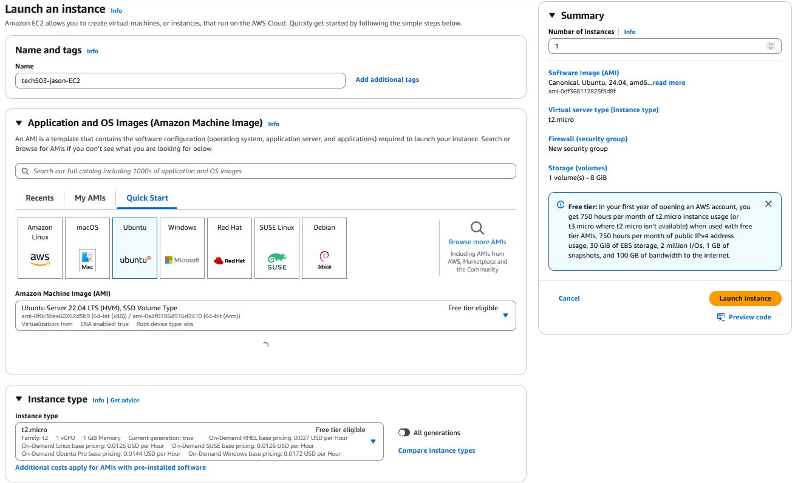

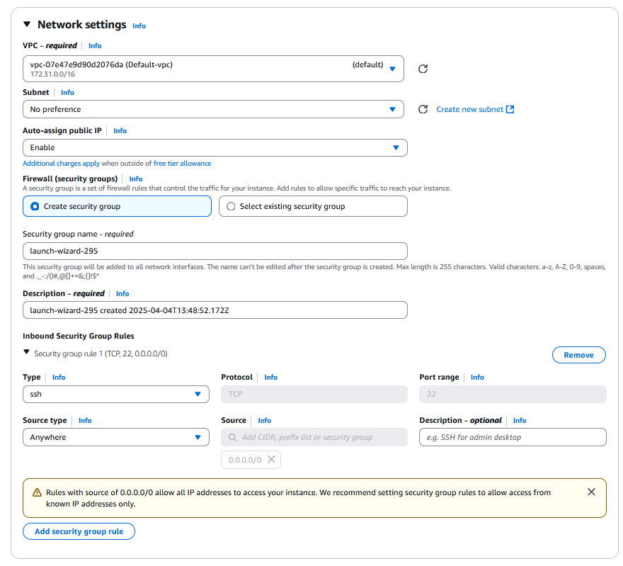

To create an AMI from an existing EC2 instance, ensure the instance is **stopped**, then select **Actions > Images and Templates > Create Image**. Before stopping the instance, configure it with all necessary packages and dependencies (e.g., NPM, PM2 for a Node.js application).

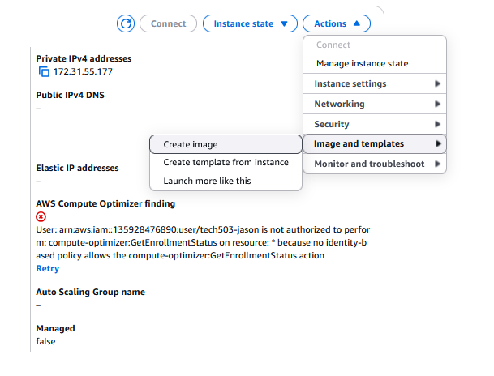

## Launch Templates (LTs)

A **Launch Template** contains the configuration information required to launch an EC2 instance. It includes details such as the AMI ID, key pair, security groups, compute resources, and storage configuration. Launch templates streamline and automate the process of launching EC2 instances by bundling all necessary information.

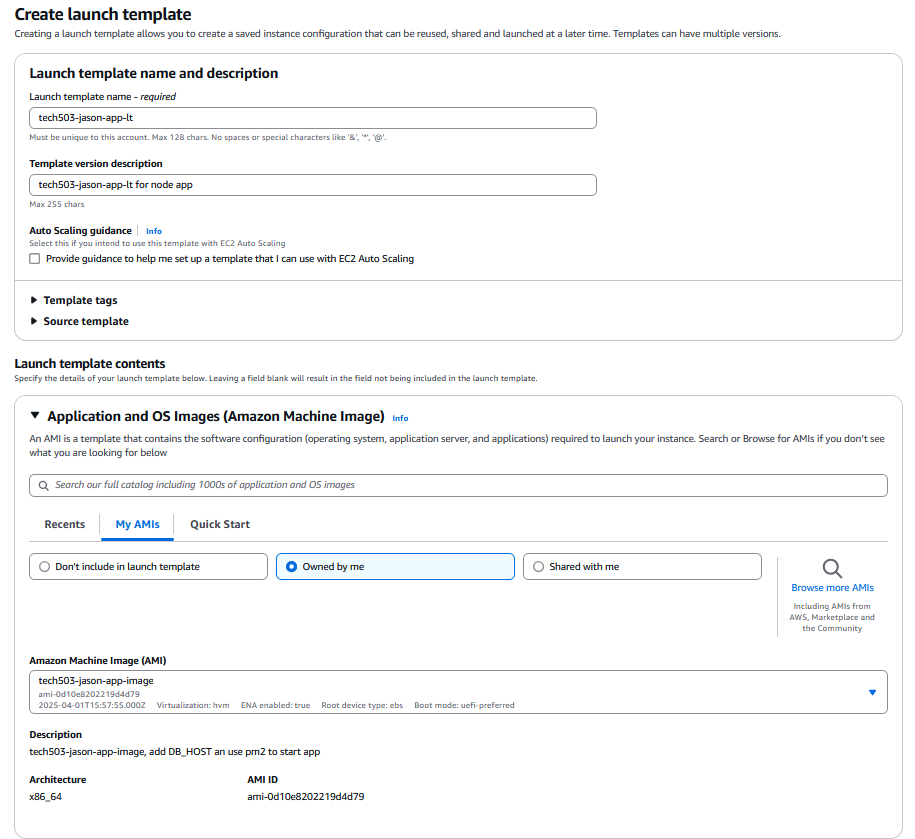

When creating a launch template, you must:
- Specify the AMI to be used.
- Configure **User Data**: This feature allows you to pass commands or scripts that will run once the instance starts.
- Optionally add resource tags (key-value pairs) to help organize and manage your cloud resources.

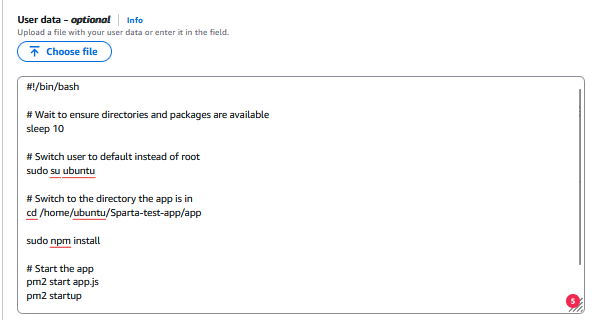

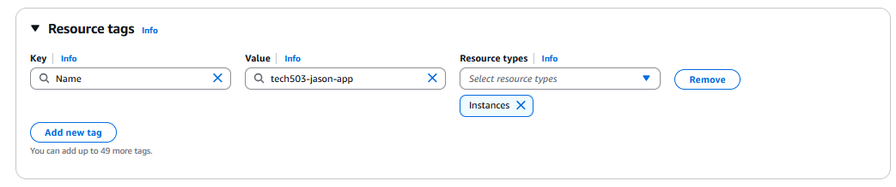

## Auto Scaling Groups (ASGs)

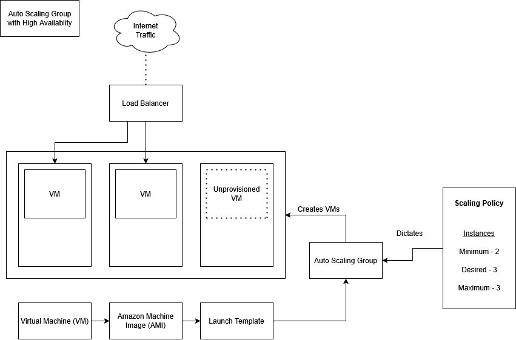

An **Auto Scaling Group (ASG)** in AWS is a collection of EC2 instances managed as a single logical group for automatic scaling and management. ASGs help maintain application availability and allow you to automatically add or remove instances according to defined scaling policies.

### Key Features of ASGs

- **Scaling Policies**: Dynamically adjust the number of instances based on demand.
- **Health Checks**: Perform periodic checks on instances to ensure they are running correctly.
- **Integration with Load Balancers**: Distribute incoming traffic evenly across all instances.
- **Tagging**: Organize and track resources with key-value pairs that can be used for cost tracking and access control.

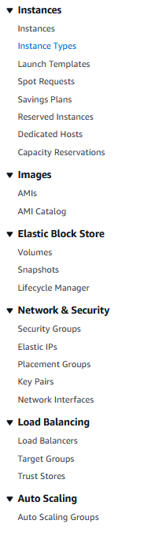

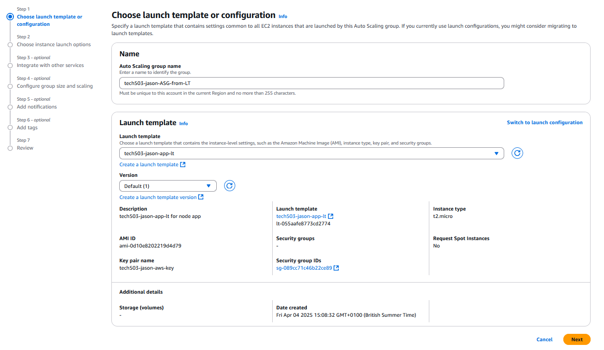

### Steps to Create an Auto Scaling Group

1. **Initial Setup**  
   - Specify the ASG name and choose the Launch Template.
   - Define the desired capacity (initial number of instances) and set minimum and maximum limits.

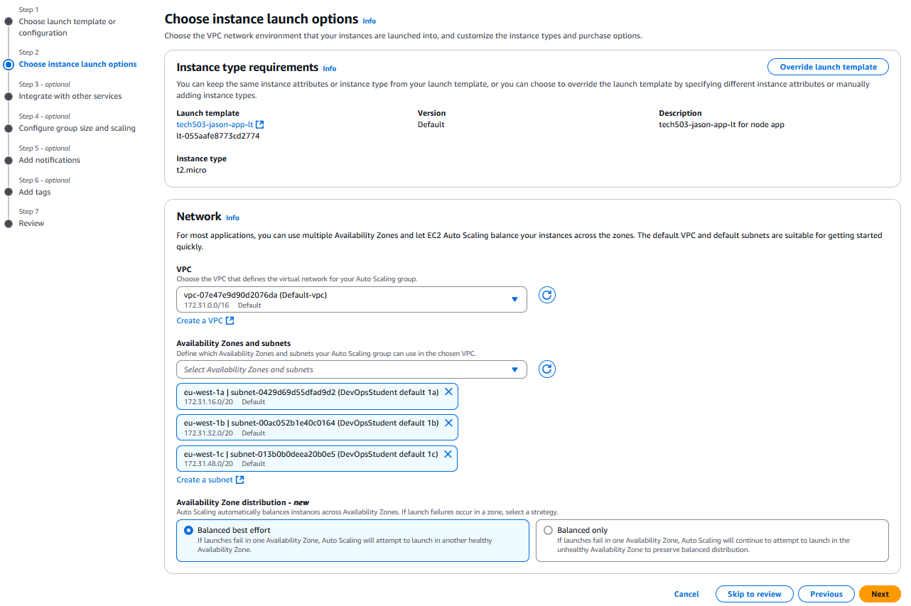

2. **Network Configuration**  
   - Select the VPC and the appropriate availability zones/subnets.
   - If using a load balancer, choose whether to attach your ASG to one. An internet-facing load balancer can manage incoming traffic efficiently.

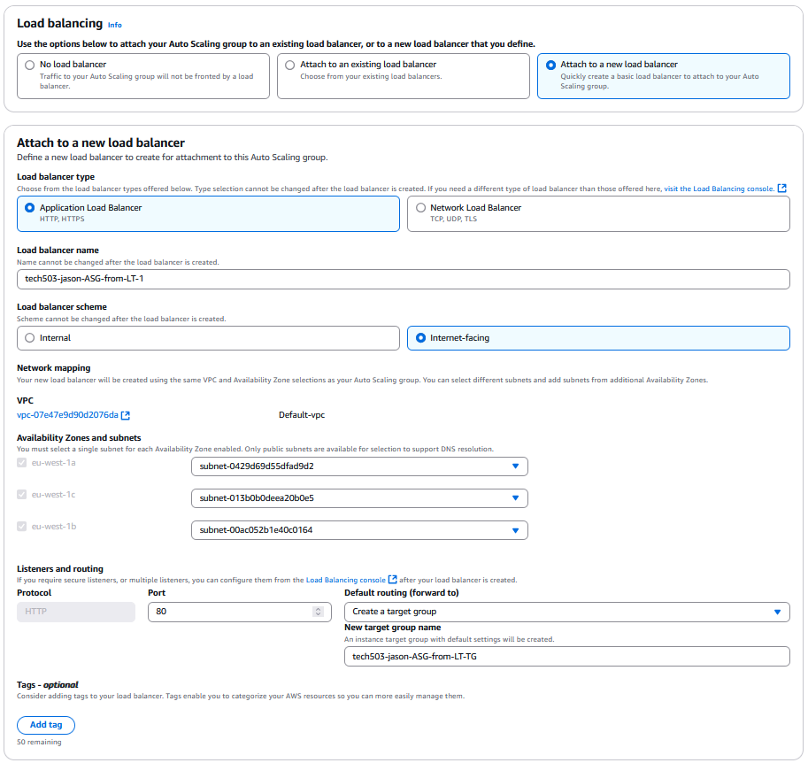

3. **Load Balancing and Scaling**  
   - Configure load balancing settings to distribute incoming traffic.
   - Define scaling policies and set up instance maintenance policies to ensure high availability.

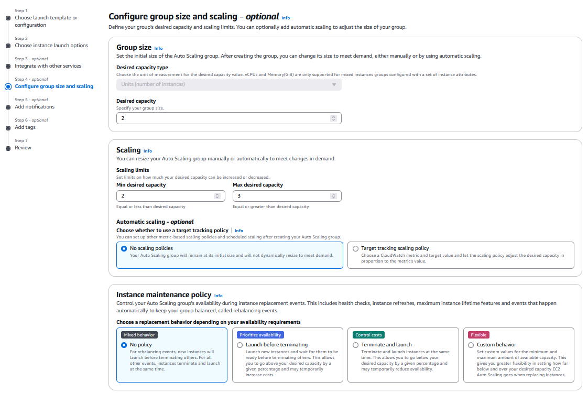

4. **Group Size and Monitoring**  
   - Set the desired capacity and scaling limits.
   - Enable CloudWatch metrics for monitoring performance and health.

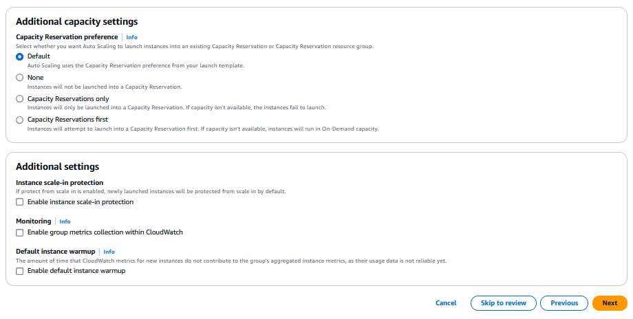

5. **Notifications and Tagging**  
   - Configure Amazon SNS to receive notifications for instance launches or terminations.
   - Apply tags to the ASG for resource management, cost tracking, and access control.

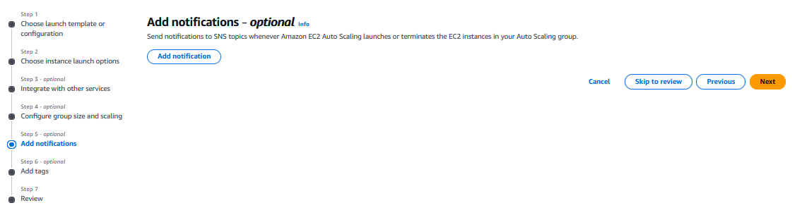

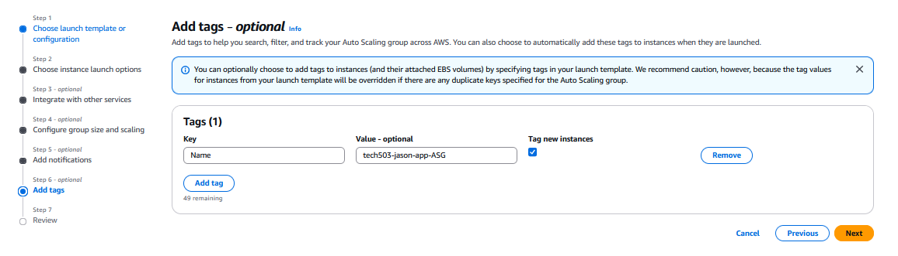

6. **Resource Organization**  
   - Use tagging to identify and organize AWS resources across services.
   - Tagging an ASG with a name attribute ensures created instances are named.

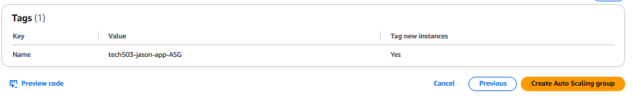

## Deletion Order

When deleting resources, follow this order to ensure a clean removal:

1. **Load Balancer**
2. **Target Group**
3. **Auto Scaling Group**
4. **EC2 Instances**
