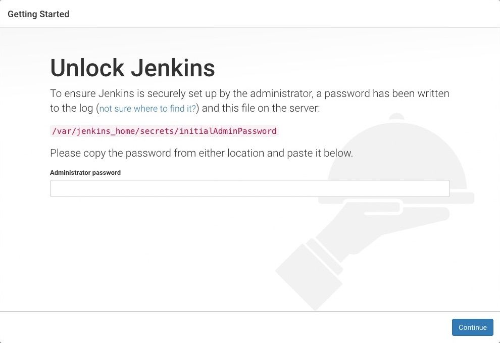

# Setting Up a Jenkins Server

This guide walks through the installation and initial configuration of a Jenkins server on Ubuntu/Debian Linux.

## Prerequisites

Before starting, ensure your system meets these requirements:
- Ubuntu/Debian-based Linux distribution
- Sudo privileges
- Internet connectivity
- At least 2GB RAM and 10GB free disk space

## Installation Process

### Step 1: Install Java

Jenkins requires Java to run. Install OpenJDK 17:

```bash
sudo apt update
sudo apt install fontconfig openjdk-17-jre
```

Verify Java installation:

```bash
java -version
```

### Step 2: Install Jenkins

Add the Jenkins repository and install the stable version:

```bash
# Add the Jenkins repository key
sudo wget -O /usr/share/keyrings/jenkins-keyring.asc \
  https://pkg.jenkins.io/debian-stable/jenkins.io-2023.key

# Add the Jenkins repository to sources list
echo "deb [signed-by=/usr/share/keyrings/jenkins-keyring.asc]" \
  https://pkg.jenkins.io/debian-stable binary/ | sudo tee \
  /etc/apt/sources.list.d/jenkins.list > /dev/null

# Update package lists and install Jenkins
sudo apt-get update
sudo apt-get install jenkins
```

### Step 3: Start and Enable Jenkins Service

Configure Jenkins to start automatically on system boot:

```bash
sudo systemctl enable jenkins
```

Start the Jenkins service:

```bash
sudo systemctl start jenkins
```

Verify Jenkins is running:

```bash
sudo systemctl status jenkins
```

## Initial Configuration

### Step 1: Unlock Jenkins

When accessing Jenkins for the first time, you'll need to unlock it using an automatically generated password:



Retrieve the initial admin password:

```bash
sudo cat /var/lib/jenkins/secrets/initialAdminPassword
```

Open Jenkins in your web browser by navigating to:

```
http://your-server-ip:8080
```

Enter the password in the form to unlock Jenkins.

### Step 2: Install Plugins

After unlocking Jenkins, you'll be prompted to install plugins.


Select "Select plugins to install" for customized setup. The following plugins are recommended for a NodeJS CI/CD pipeline:

#### SSH Agent Plugin
Allows Jenkins to use SSH keys for authentication with remote servers.


#### NodeJS Plugin
Provides Jenkins integration with NodeJS and npm.


#### GitHub Plugin
Integrates Jenkins with GitHub repositories.


### Step 3: Create Admin User

After installing plugins, create your first admin user:


Fill in the required information:
- Username
- Password
- Full name
- Email address