# Setting up a CI/CD Pipeline with GitHub, Jenkins and AWS EC2

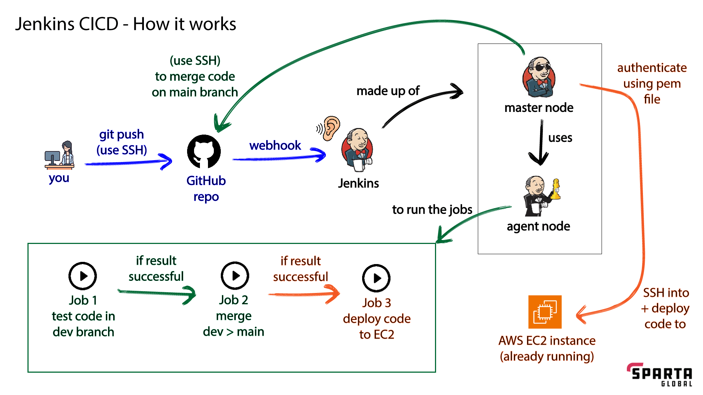

## Overview

This guide walks through creating a continuous integration and continuous deployment (CI/CD) pipeline as shown in the diagram above. The pipeline automatically tests, merges, and deploys code changes from a NodeJS application hosted in a private GitHub repository.

### Pipeline Workflow

When code is pushed to the **dev** branch, the pipeline will automatically:

1. Run tests on the new code changes
2. Merge passing changes to the **main** branch
3. Deploy the updated application to the production AWS EC2 environment

### Prerequisites

Before starting, ensure you have:

- A configured Jenkins server with a master node capable of managing agent nodes
- A NodeJS application stored in a GitHub repository with separate **dev** and **main** branches
- An AWS EC2 instance configured with a reverse proxy for the NodeJS app
- Basic understanding of Git, Jenkins, and AWS

---

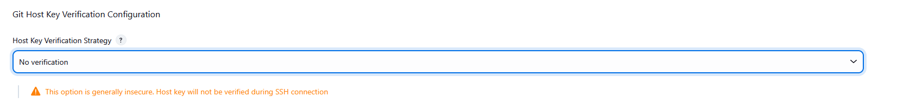

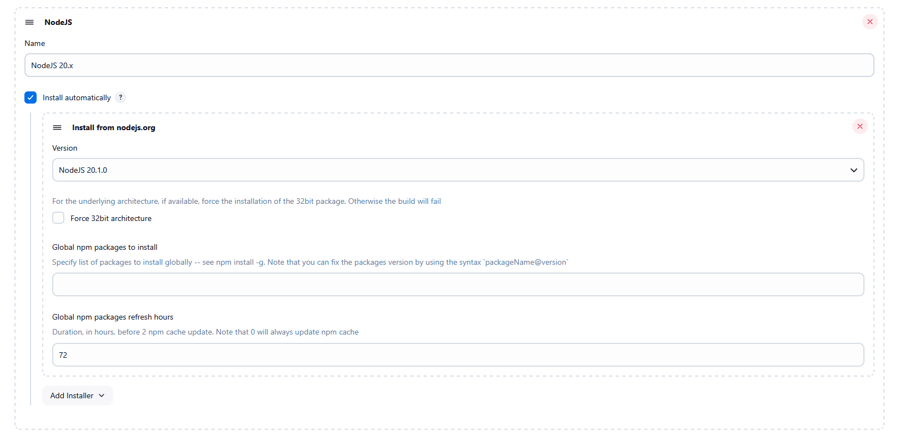

- In Jekinks configuration settings, ensure a NodeJS version has been specified for the NodeJS plugin
- Also ensure the Git host key verification configuration is set to no verification

## Pipeline Setup Process

The complete pipeline consists of three Jenkins jobs:

1. **Build & Test Job**: Triggered by pushes to the dev branch
2. **Merge Job**: Merges passing code from dev to main
3. **Deploy Job**: Deploys the merged code to production


## Job 1: Building and Testing the App

### Create the Job

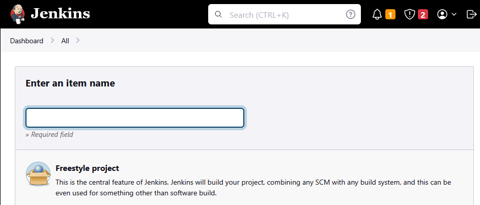

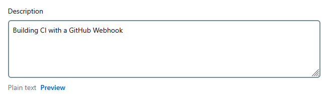

1. In Jenkins, select "New Item"
2. Choose "Freestyle project"
3. Provide a descriptive name and description

### Configure Build Retention

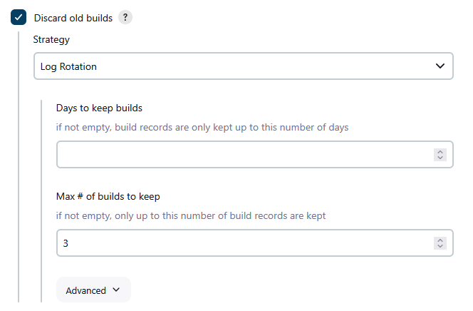

Set the job to discard old builds and keep only the last 3 builds to conserve server resources.

### Configure GitHub Integration

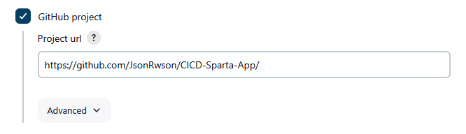

Enter the URL to your GitHub project.

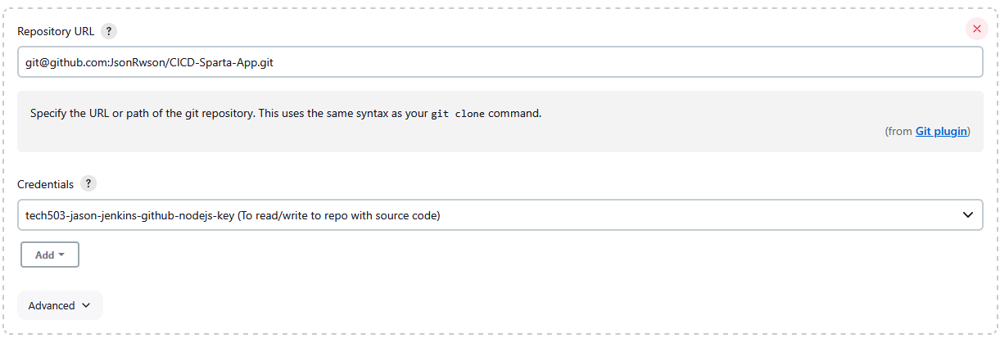

Provide the SSH URL to your repository (found by clicking the green "Code" button in GitHub).

### Set Up SSH Authentication

```bash
ssh-keygen -t rsa -b 4096 -C "your-email@example.com"
```

Generate an SSH key pair to create a **Deploy Key** for the GitHub repository, which will grant Jenkins access to the repo.

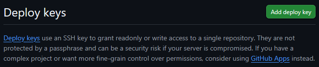

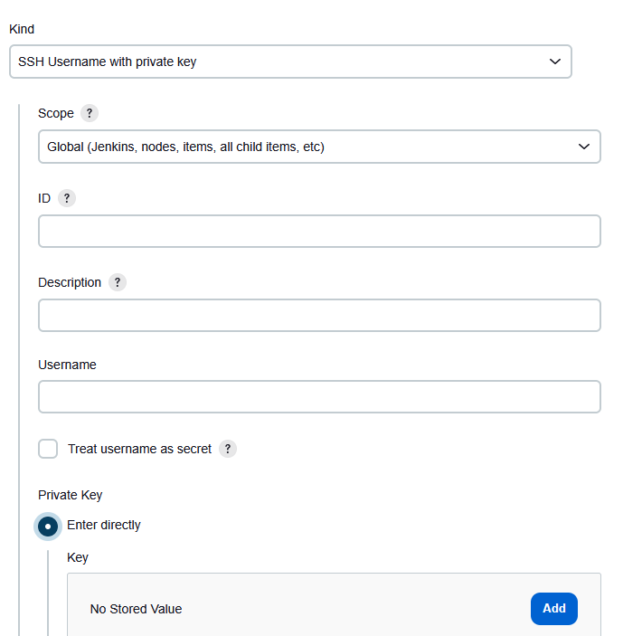

In Jenkins Credential Manager:
1. Create an SSH Username with private key
2. Provide a meaningful identifier
3. Select "Enter directly" and paste your private key content
   - Run `cat private-key-name` to get the content

In GitHub repository settings:
1. Add a new deploy key
2. Paste the public key content
   - Run `cat public-key-name.pub` to get the content
3. Enable write access if needed

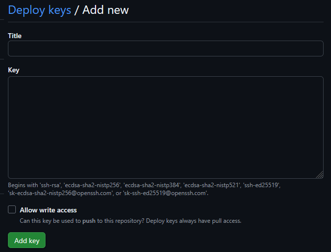

### Configure Branch and Build Triggers

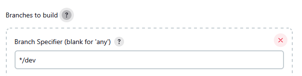

Specify the **dev** branch as the branch to build and test.

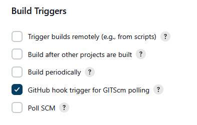

Enable GitHub webhook integration to automatically trigger builds on push events.

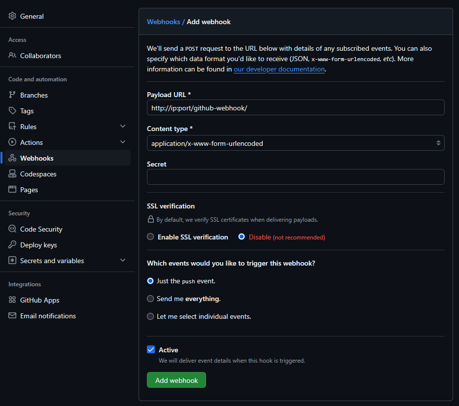

Set up a webhook in GitHub repository settings to notify Jenkins of changes.

### Configure Build Environment

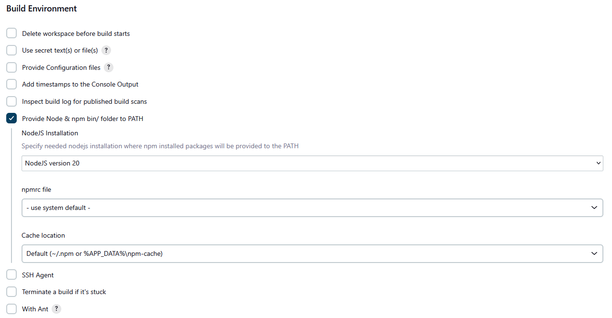

Use the NodeJS plugin to provide the appropriate runtime environment:
1. Check "Provide Node & npm bin/ folder to PATH"
2. Select the NodeJS version that matches your application

### Add Build Steps

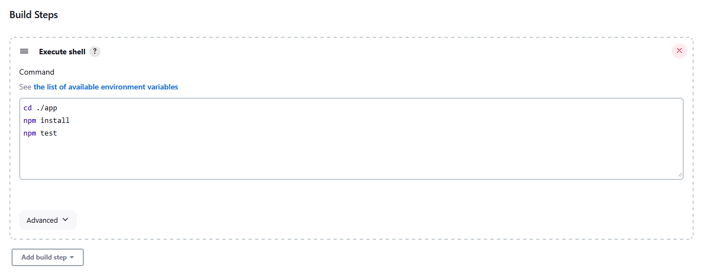

Add an "Execute shell" build step with commands to build and test your app, such as:

```bash
npm install
npm test
```

### Configure Build Chain

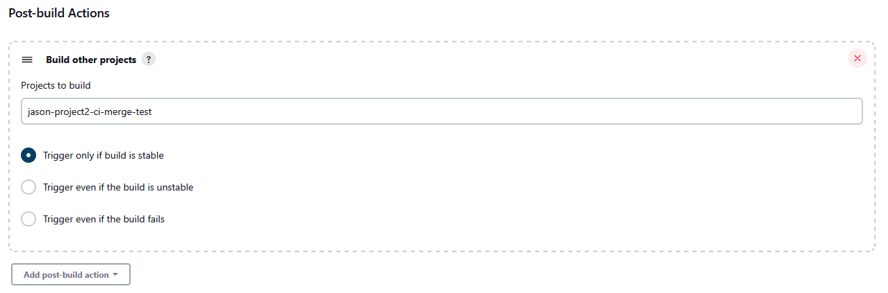

After creating Job 2, return to Job 1 and add a post-build action:
1. Select "Build other projects"
2. Choose Job 2
3. Select "Trigger only if build is stable"

---

## Job 2: Merging Changes from Dev to Main

### Create the Job

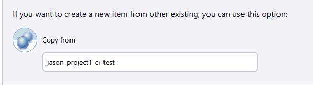

Create a new job by copying from Job 1 to save time and maintain consistency.

### Configure Triggers

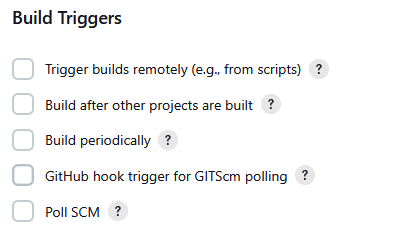

Uncheck "GitHub hook trigger" since this job will be triggered by the successful completion of Job 1.

### Configure Git Publisher

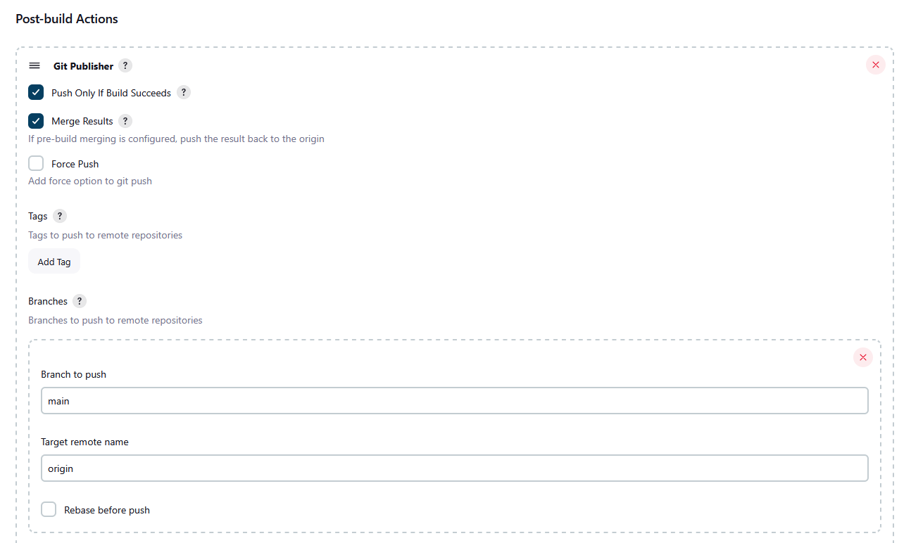

Add a "Git Publisher" post-build action to:
1. Merge the successful changes to the **main** branch
2. Push the merged changes to the remote repository

### Configure Build Chain

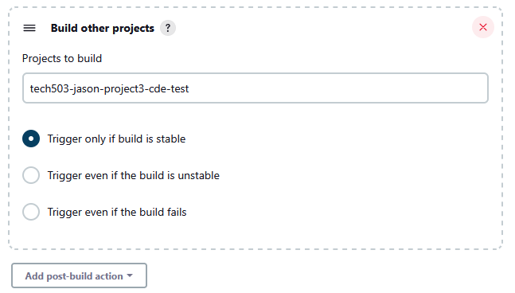

After creating Job 3, return to Job 2 and add a post-build action:
1. Select "Build other projects"
2. Choose Job 3
3. Select "Trigger only if build is stable"

---

## Job 3: Deploying to AWS EC2

### Prerequisites

Before configuring this job, ensure your EC2 instance:
- Is properly running
- Has the required security group rules:
  - Port **80** (HTTP) open for web traffic
  - Port **22** (SSH) open for deployment access
- Has NodeJS and PM2 installed

### Create the Job

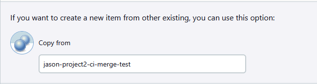

Create a new job by copying from Job 2 to maintain consistent configuration.

### Configure Branch

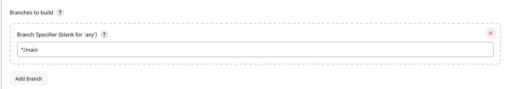

Change the branch to build to **main** since we want to deploy the merged, tested code.

### Configure SSH

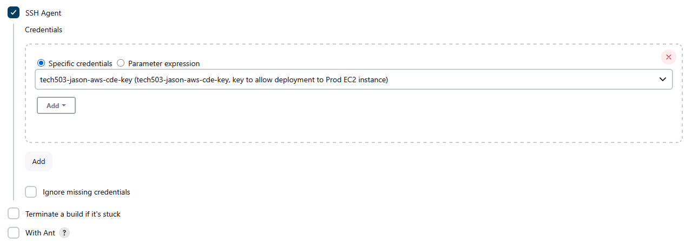

Under build environment:
1. Check "SSH Agent"
2. Add the EC2 instance's private key credentials
3. This allows Jenkins to securely connect to the EC2 instance

### Configure Deployment Script

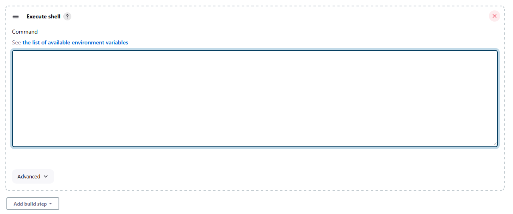

Remove previous build steps and add a new "Execute shell" step with the deployment script:

```bash
rsync -avz -e "ssh -o StrictHostKeyChecking=no" app user@Public-IPv4-DNS:/home/user
ssh -o "StrictHostKeyChecking=no" user@Public-IPv4-DNS <<EOF

   cd app
   npm install
   pm2 kill
   pm2 start app.js

EOF
```

## Understanding the Deployment Script

Replace `user@Public-IPv4-DNS` with your EC2 instance's actual public DNS and username.

### File Transfer

```bash
rsync -avz -e "ssh -o StrictHostKeyChecking=no" app user@Public-IPv4-DNS:/home/user
```

This command:
- Uses `rsync` to efficiently transfer only changed files
- `-a` preserves file attributes and permissions
- `-v` shows verbose output for troubleshooting
- `-z` compresses data during transfer
- `-e "ssh -o StrictHostKeyChecking=no"` disables SSH prompts
- Copies the `app` directory to `/home/user` on the EC2 instance

### Remote Commands

```bash
ssh -o "StrictHostKeyChecking=no" user@Public-IPv4-DNS <<EOF
```

This section:
- Opens an SSH connection to the EC2 instance
- Uses a here-document (`<<EOF`) to send multiple commands

### Application Deployment

```bash
   cd app
   npm install
   pm2 kill
   pm2 start app.js
```

These commands:
1. Navigate to the app directory
2. Install or update Node dependencies
3. Stop any currently running instances of the app
4. Start the application using PM2 process manager

The `EOF` marker ends the here-document block.

## Understanding CI/CD and Jenkins

### What is CI/CD?

**Continuous Integration (CI)** and **Continuous Deployment/Delivery (CD)** are software development practices that enable teams to deliver code changes more frequently and reliably:

- **Continuous Integration (CI)** is the practice of frequently merging code changes into a shared repository, where automated builds and tests verify each integration. This helps detect integration problems early, improves code quality, and reduces the time to validate and release new features.

- **Continuous Delivery (CD)** extends CI by automatically deploying all code changes to a testing or staging environment after the build stage. This ensures that code is always in a deployable state and enables faster feedback loops.

- **Continuous Deployment** takes CD further by automatically deploying every change that passes all verification stages directly to production, without human intervention.

### Jenkins in the CI/CD Pipeline

**Jenkins** is an open-source automation server that facilitates CI/CD practices through its powerful pipeline capabilities:

- **Automation Hub**: Jenkins orchestrates the entire software delivery process, from code commits to production deployment
- **Extensibility**: With over 1,500 plugins, Jenkins integrates with virtually any tool in the development ecosystem
- **Distributed Architecture**: Jenkins can distribute build and test loads across multiple agents
- **Pipeline as Code**: Jenkins pipelines can be defined in a Jenkinsfile, allowing version control of the CI/CD process itself

In our pipeline, Jenkins performs three critical roles:

1. **Build & Test Orchestration**: Automatically pulls code from GitHub when changes are detected, then builds and tests the application
2. **Branch Management**: Handles the merging of verified code from development to main branches
3. **Deployment Automation**: Securely connects to AWS EC2 and deploys the application to production

This automation eliminates error-prone manual steps, ensures consistent testing before deployment, and provides visibility into the entire delivery process through the Jenkins dashboard.

