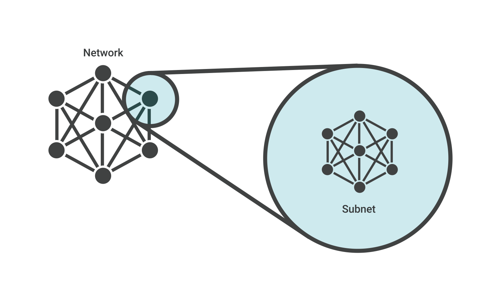
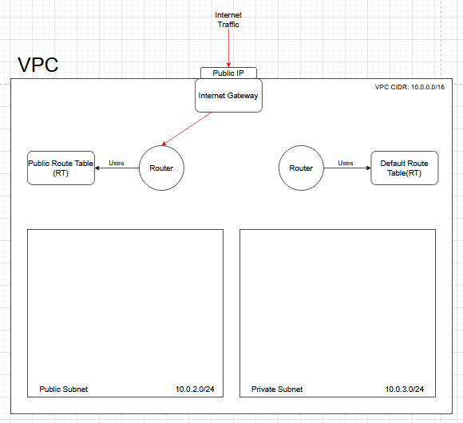

# Virtual Private Cloud (VPC)

## Introduction to Cloud Types

### What is a public cloud?
A public cloud is shared cloud infrastructure where multiple customers access the same infrastructure while maintaining data separation, known as "multitenancy." Public cloud service providers include AWS, Google Cloud Platform, and Microsoft Azure, among others.

### What is a private cloud?
A private cloud is a single-tenant cloud service exclusively offered to one organization.

## Understanding VPCs

### What is a VPC?
A Virtual Private Cloud (VPC) is a secure, isolated private cloud hosted within a public cloud. VPC customers can run code, store data, host websites, and perform any tasks they could do in an ordinary private cloud, but with the advantage of being hosted remotely by a public cloud provider.

### Amazon VPC
**Amazon Virtual Private Cloud** (Amazon VPC) is Amazon's implementation of a VPC service. With Amazon VPC, you can launch AWS resources in a logically isolated virtual network that closely resembles a traditional private network while benefiting from AWS's scalable infrastructure.

The following diagram shows an example AWS VPC with one subnet in each Availability Zone in the Region, EC2 instances in each subnet, and an internet gateway enabling communication between VPC resources and the internet.

## Business Benefits of a VPC

A VPC gives businesses a secure, flexible, and high-performing environment that feels like a private cloud but runs on the power of the public cloud.

### Enhanced Security
- Public cloud providers that offer VPCs often have more resources for updating and maintaining infrastructure, especially beneficial for small and mid-market businesses
- Your VPC is logically separated from other customers on the same cloud—other users cannot "see" your resources
- A VPC has a dedicated subnet and Virtual Local Area Network (VLAN) accessible only by the VPC customer
- Your network is protected from public internet exposure

### Scalability
- Because a VPC is hosted by a public cloud provider, customers can add computing resources on demand
- Resources can be easily scaled up or down based on demand, ensuring adequate capacity without over-provisioning

### Performance
- Cloud-hosted websites and applications typically perform better than those hosted on local on-premises servers
- You receive the benefits of private cloud infrastructure with the high performance and network speeds of a public datacenter, without needing to provision and maintain hardware

### Cost Savings
- Businesses do not need to maintain or invest in physical infrastructure and benefit from pay-as-you-go pricing
- The need for specialized roles to maintain infrastructure and troubleshoot is vastly reduced
- VPCs automate many infrastructure tasks, saving time and effort for IT teams

## How VPCs Aid DevOps

### Hybrid Cloud
- VPCs let you define your own IP ranges, subnets, and routing—just like your on-prem network
- This makes it easy to "extend" your internal network into the cloud, so it feels like part of your private environment

### Infrastructure as Code (IaC)
- Fast, repeatable, consistent environments with no manual setup
- VPCs can be defined and managed using IaC tools like Terraform or CloudFormation, enabling automation of network infrastructure provisioning and management

### Continuous Integration / Continuous Deployment (CI/CD)
- VPCs can create isolated environments for different stages of the CI/CD pipeline (development, testing, production)
- VPCs integrate easily with DevOps automation tools and workflows
- You can automate the provisioning and configuration of VPCs and their components, streamlining deployment

### Security and Control
- VPCs create a logically isolated section of the cloud, allowing you to define network boundaries and control resource access
- Cross-contamination of environments is reduced, preventing accidental interactions between workloads
- VPCs provide granular control over network configurations, including IP address ranges, subnets, routing, internet gateways, NAT gateways, and Access Control Lists (ACLs)
- VPC flow logs can capture information about IP traffic for monitoring, troubleshooting, and security auditing

## Why AWS Introduced VPCs

AWS introduced Virtual Private Clouds (VPCs) in 2009 to give users greater network isolation, security, and control—addressing limitations in the original EC2-Classic environment.

As more enterprises moved to the cloud, they needed features like custom IP ranges, private subnets, VPN access, and hybrid cloud integration, which VPCs made possible.

It was also a response to demand for more secure, DevOps-friendly environments that could be managed as code and scaled with confidence, especially for organizations with sensitive requirements such as healthcare and government.

## Components of a VPC

A VPC isolates computing resources from other resources available in the public cloud through several key technologies:

### Subnets

A subnet is a range of IP addresses within a network reserved for private use, essentially dividing part of the network. In a VPC, these are private IP addresses that are not accessible via the public Internet, unlike typical IP addresses that are publicly visible.

#### CIDR Blocks and Subnet Masks
Subnets use CIDR notation to define IP address ranges. For example, a subnet with CIDR 10.0.1.0/24 reserves the first three octets (24 bits), allowing for 256 IP addresses (2^8) in that subnet.

#### Public vs Private Subnets
- **Public subnet**: Has a direct route to an internet gateway, allowing resources within it to access the public internet
- **Private subnet**: Does not have public internet access, requiring a NAT device or similar for internet access

### VLAN
A LAN is a local area network, or a group of computing devices connected to each other without using the Internet. A VLAN is a virtual LAN. Like a subnet, a VLAN partitions a network, but the partitioning occurs at a different layer within the OSI model (layer 2 instead of layer 3).

### NAT (Network Address Translation)
NAT allows instances in a private subnet to initiate outbound traffic to the internet while preventing inbound traffic from the internet from reaching those instances. This provides an additional layer of security while allowing necessary outbound communications.

### Internet Gateways
An Internet Gateway allows communication between your VPC and the internet. It provides a target in your VPC route tables for internet-routable traffic and performs network address translation for instances with public IP addresses.

### Route Tables
Route tables contain a set of rules (routes) that determine where network traffic is directed. Each subnet in your VPC must be associated with a route table, which controls the routing for the subnet.

### Security Groups
Security Groups act as virtual firewalls that control inbound and outbound traffic at the instance level. Each security group contains rules that allow specific traffic to reach the instances associated with the security group.

## Steps to Deploy a 2-tier Application in a VPC on AWS

### 1. Create the VPC

 

- Provide a name
- Provide an IPv4 CIDR (use 10.0.0.0/16)
  - Last 2 octets (0-255) are flexible
  - First 2 octets are reserved
  - /8 reserves 1st octet, /16 reserves 1st and 2nd, and so on

### 2. Create and Attach an Internet Gateway

 

- Create an internet gateway
  - This allows the app to access the internet
  - It also allows internet users to access the app

- Attach the Internet gateway to the VPC so the public subnet can access the internet

### 3. Create Subnets

- Create subnets
- Provide the ID of the VPC to place subnets within

- Create public subnet
  - The public subnet will host the app, so users can access the website
  - Use 10.0.2.0/24 for CIDR
  - 3×8 = 24, first 3 digits are reserved, we use "2" to represent the public subnet

- Create a private subnet
  - The private subnet will host the database
  - This prevents the database from being publicly exposed
  - The app can still interact with the DB as it sits in the same VPC
  - Place subnets in different availability zones for redundancy

### 4. Configure Route Tables

- Create the public route table that ensures the public subnet can access the internet and vice versa

- Associate the public route table to the public subnet so the internet gateway can be used

- Add a route to allow traffic from any address on the internet

### 5. Launch Database Instance

- Launch an EC2 instance for the database in the VPC
  - Do this first to specify the private IP for the DB when launching the app
  - Disable automatically assigning a public IP as the DB is in the private subnet
  - Create a security group to allow requests on port 27017 for MongoDB
  - New security groups are needed as they work on a per-subnet basis

### 6. Launch Application Instance

- Launch an EC2 instance for the app in the VPC
  - Change subnet and enable public IP as this is internet-facing
  - Create a custom security group as they are subnet-based, allow HTTP
  - Add user data, specify local IP of DB (this is why DB must be launched first)

## Cleanup Process

When you need to tear down your VPC environment, follow this order:

1. Remove the VMs in the VPC
2. Remove the security groups associated with the VPC
3. Remove the VPC:
   - When deleting the VPC, it should report that it will also delete these 4 resources:
     - The Internet gateway
     - The public route table
     - The private subnet
     - The public subnet