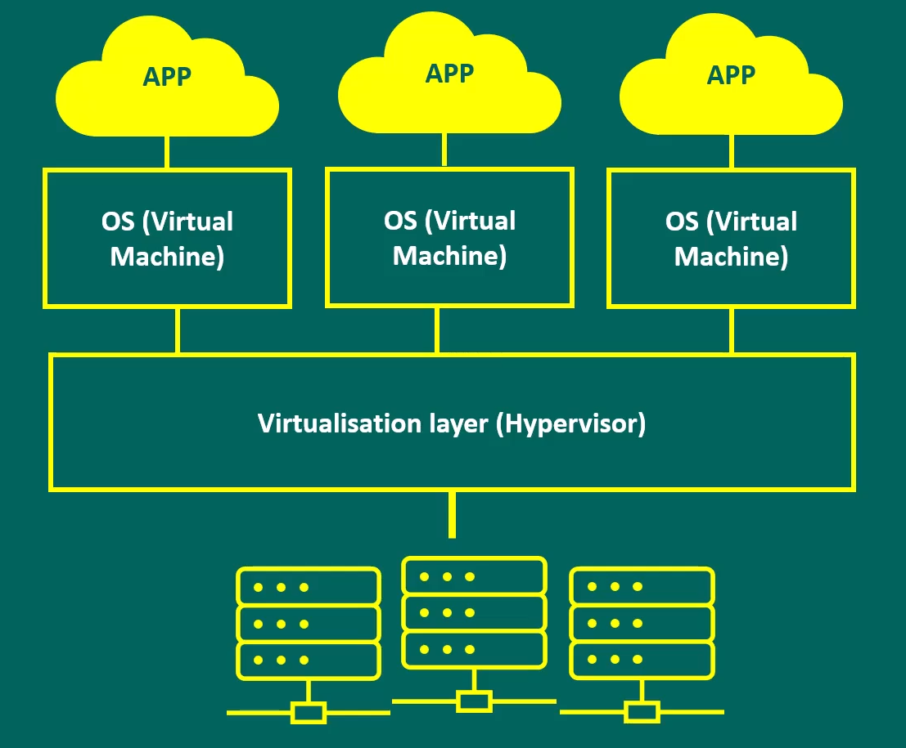
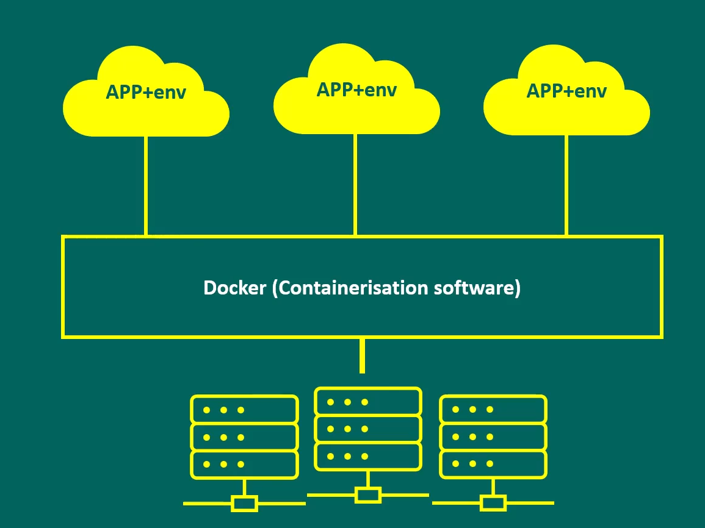
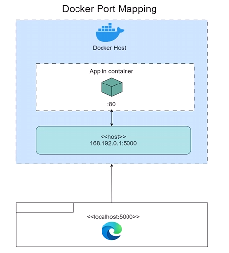

# Virtualization vs Containerization

## What is Virtualization

Virtualization is the process of creating a virtual computer that doesn't physically exist but appears to do so through software on a host machine.

You can run multiple virtual machines (VMs) on a single physical machine (called the host).
Each VM behaves like a separate computer with its own operating system and applications, even though they all share the same hardware.

A **Hypervisor** is the software that facilitates virtualization:
- It sits between the physical hardware of the host machine and the virtual machines
- It manages and allocates resources such as CPU cycles, memory, and storage to each VM

**Benefits of virtualization:**
- Run incompatible software and applications built for other operating systems on your host system
- Create isolated environments for testing and development
- Make efficient use of hardware resources

The limiting factor is the hardware capabilities of the host machine (storage, memory, processing power, etc.).

## What is Containerization

Containerization is a lightweight form of virtualization where applications run in isolated user spaces (called containers) on the same operating system.

Each container includes:
- The application
- Its dependencies (libraries, tools, config files)

Unlike virtual machines, containers share the host OS kernel—they don't each need their own full OS.

Each container contains everything the enclosed application needs to run as if it were on its native operating system, without virtualizing the entire operating system.

## Benefits of Containerization

The main benefit: Simplicity - containers are easy to use, lightweight, and abstract away many issues.

- **Portability**: Application code doesn't need to be rewritten for different systems
- **Scalability**: Containers are lightweight and efficient compared to VMs
- **Fault Tolerance**: Complex software can be broken down into isolated containerized parts; a fault in one part won't affect others
- **Agility**:
  - Changes can be made without interfering with the OS or hardware
  - Once containerized, software becomes fully isolated from its host environment

# Docker

## What is Docker?

Docker is a platform to create, monitor, and manage containers. While container creation through Linux has existed for a while, Docker makes the process and management of containers much easier.

## Why Use Docker?

- **Open Source**: Docker moved to an open source model in 2013
  - Free with no vendor lock-in
  - Well-documented with a strong community behind it

- **Reliability**: Docker is stable and compatible across environments

- **Simplicity**: Docker is intuitive and fast to use

- **Multi-cloud Support**: Docker containers can run on and work with multiple cloud providers

- **Security**: Docker has robust security features, giving companies peace of mind when using containers

## Images vs Containers

| Docker Container | Docker Image |
|------------------|--------------|
| A self-contained, runnable software application or service | The template loaded onto the container to run it (like a set of instructions) |
| Created and destroyed throughout an application's lifecycle | Stored for sharing and reuse |

## Docker Commands

### Basic Commands

`docker run <image>` - Run a Docker container
`docker ps` - Show running containers
`docker ps -a` - Show all containers (including stopped ones)
`exit` - Exit an interactive container (e.g., a shell)

### Running Containers

`docker run -it ubuntu bash`

This command runs an Ubuntu container with an interactive bash shell:

- `docker run` - Tells Docker to run a container
- `-it` - Combines two flags:
  - `-i` (interactive) - Keeps STDIN open
  - `-t` (tty) - Allocates a pseudo-terminal
- `ubuntu` - The name of the Docker image to run (pulled from Docker Hub if not local)
- `bash` - The command to run inside the container

### Background Processes

`docker run -d ubuntu sleep 15`

- Runs a container in detached mode (`-d`) in the background
- To re-attach: `docker attach <container_id>`

### Container Management

- `docker stop <container_id>` - Stop a running container
- `docker restart <container_id>` - Restart a container
- `docker rm <container_id>` - Remove a stopped container
- `docker rm -f <container_id>` - Force remove a running container
- `docker exec -it <container_id> <command>` - Execute a command inside a running container

### Image Management

- `docker images` - List all Docker images
- `docker pull <image>` - Download an image from Docker Hub
- `docker rmi <image_id>` - Remove an image
- `docker build -t my-image .` - Build an image from a Dockerfile in the current directory

## Docker Hub

Docker Hub is Docker's official cloud-based registry where you can:

- Store container images (public or private)
- Share images with others
- Pull images to your local machine
- Push images you've created
- Discover official and community images (like ubuntu, nginx, mysql, etc.)

Think of Docker Hub as the GitHub of container images.

## Docker Container Ports

Docker containers are isolated environments. Even if a web server (like NGINX) is running inside the container, it doesn't automatically expose itself to the outside world.

### Port Mapping

- The host computer has its own network stack and ports (80, 3000, 8080, etc.)
- A Docker container runs in an **isolated network space** with its own ports
- Container ports must be explicitly mapped to host ports

Use the `-p` flag to map ports:
`docker run -d -p 80:80 nginx`

Format: `-p HOST_PORT:CONTAINER_PORT`

This maps host port 80 to container port 80, allowing outside traffic to reach the NGINX server.

## Manually Creating Docker Images

Creating custom images allows us to package our application with specific configurations:

1. Start with a base image:
   `docker run --name my_website -d -p 80:80 nginx`

2. Interact with the container:
   `docker exec -it my_website bash`

3. Remove the default index.html:
   `cd user/share/nginx/html && rm index.html`

4. Copy your custom index.html:
   `docker cp index.html my_website:user/share/nginx/html/index.html`
   - `cp` stands for copy
   - `index.html` is the file to copy from your machine
   - `my_website` is the container name
   - `:user/share/nginx/html/index.html` is the destination path

5. Commit the changes to a new image:
   `docker commit my_website my_website_from_image`

6. Clean up the container:
   `docker rm -f my_website`

7. Run your new image:
   `docker run -d -p 80:80 my_website_from_image`

8. Tag for Docker Hub (username required):
   `docker commit <container_id> uname/docker_test_website:latest`

9. Push to Docker Hub:
   `docker push uname/docker_test_website:latest`