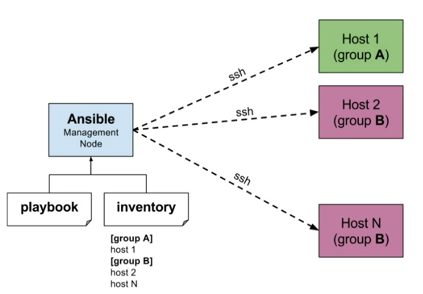
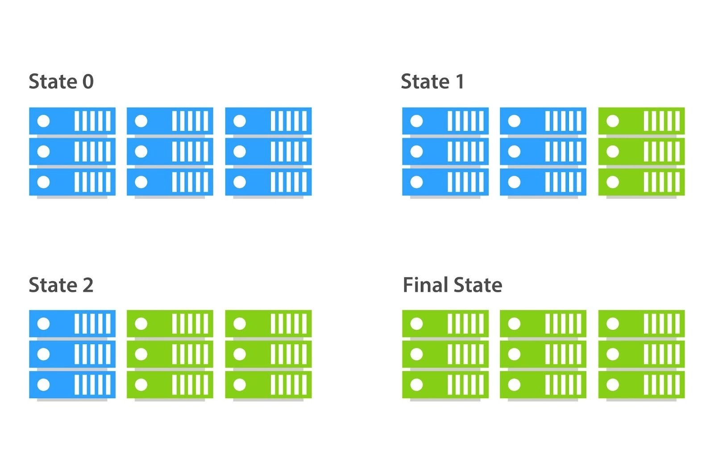

## Ansible

### What is Ansible?

Ansible is an open-source IT automation tool, written in Python, used for configuration management, application deployment, orchestration, and task automation.
<br>It allows you to manage infrastructure as code (IaC), enabling repeatable and consistent system administration.

It operates over SSH, meaning no agents need to be installed on the target machines.
<br>It's especially popular for managing cloud infrastructure like AWS EC2 instances.



### Blue-Green Deployment



Tools like Ansible are great for implementing blue-green deployment
<br>Blue-green deployment is a strategy used to release applications with minimal downtime and risk by running two identical environments, known as "blue" and "green".

1. Blue = Live Environment
<br>This is the version currently serving users.

1. Green = New Version
<br>A copy of the environment where the new version of the application is deployed and tested.

1. Switch Traffic
<br>Once the green environment is fully tested and ready, traffic is redirected from blue to green—either instantly (DNS/load balancer switch) or gradually.

1. Blue becomes standby
<br>The previous blue version remains available as a backup in case rollback is needed.

The use of groups like `[web]` can facilitate this

#### Benefits:
- Zero downtime deployments
- Quick rollback: Just switch back to blue if something goes wrong.
- Safe testing in production-like environment

### Installing Ansible - Setting up a Controller Server

1. **Ensure Python is installed**  
   Ansible requires Python 3 to run:
   ```bash
   python3 --version
   ```

2. **Add Ansible's official PPA repository**  
   ```bash
   sudo DEBIAN_FRONTEND=noninteractive apt-add-repository ppa:ansible/ansible
   ```

3. **Install Ansible**
   ```bash
   sudo apt update
   sudo apt install ansible -y
   ```

### SSH Key Setup

1. Generate or provide an existing SSH keypair.
2. Place your private key in the `~/.ssh` folder, e.g.:
   ```bash
   ~/.ssh/my-key.pem
   ```
3. Ensure the file has the correct permissions:
   ```bash
   chmod 400 ~/.ssh/my-key.pem
   ```

### Ansible Inventory

The Ansible inventory file—commonly referred to as the hosts file—is a file where you define the managed nodes (remote systems) that Ansible will control.

Create or edit the `hosts` inventory file:
```bash
sudo nano /etc/ansible/hosts
```

Example inventory file (ini):

```ini
[web]  # Group name

ec2-instance ansible_host=<placeholder-ip> ansible_user=ubuntu ansible_ssh_private_key_file=/home/ubuntu/.ssh/<placeholder-key-name>
```


### Inventory Commands

- List available inventory:
  ```bash
  ansible-inventory --list
  ```
- Display inventory graph:
  ```bash
  ansible-inventory --graph
  ```

### Ad-hoc Commands

Ad-hoc commands are one-liners used to quickly run tasks on remote systems. These are useful for simple, one-time operations.

[Ansible modules](https://docs.ansible.com/ansible/latest/collections/index_module.html)

- **Ping all hosts**
  ```bash
  sudo ansible all -m ping
  ```

- **Run a shell command**
  ```bash
  sudo ansible web -a "uname -a"
  ```
  > Note: If no module is specified, Ansible uses the default `command` module.

- **Update APT cache**
  ```bash
  sudo ansible web -m ansible.builtin.apt -a "update_cache=yes" --become
  ```

- **Upgrade packages**
  ```bash
  sudo ansible web -m ansible.builtin.apt -a "upgrade=dist" --become
  ```

- **Copy a file over**
  ```bash
  sudo ansible web -m ansible.builtin.copy -a "src=<path to file> dest=<destination path>"
  ```

`--become` provides sudo access 

To disable the [WARNING] relating to the discovered Python interpreter
add the following lines to ansible.cfg in /etc/ansible/ansible.cfg

```ini
[defaults]
 
interpreter_python = auto_silent
```

To disable the "known hosts" prompt when using SSH add this line under defaults:
<br>`host_key_checking = False`


### Playbooks

[Playbooks](https://docs.ansible.com/ansible/latest/getting_started/get_started_playbook.html)

[Built in modules](https://docs.ansible.com/ansible/latest/collections/ansible/builtin/index.html)

Playbooks are YAML files that define a series of tasks to be executed on specified hosts.
<br>Unlike ad-hoc commands, playbooks are reusable, structured, and allow for more complex logic such as conditionals, loops, handlers, etc.

**Playbook**

    A list of plays that define the order in which Ansible performs operations, from top to bottom, to achieve an overall goal.
**Play**

    An ordered list of tasks that maps to managed nodes in an inventory.
**Task**

    A reference to a single module that defines the operations that Ansible performs.
**Module**

    A unit of code or binary that Ansible runs on managed nodes.

Here is an example playbook which simply 

```yml
---
- name: My first play
  hosts: all
  tasks:
   - name: Ping my hosts
     ansible.builtin.ping:

   - name: Print message
     ansible.builtin.debug:
       msg: Hello world
```

Run a playbook:
<br>`ansible-playbook <path to playbook>`

Check syntax of a playbook before running:
<br>`ansible-playbook --syntax-check install-nginx.yml`

Dry run of playbook:
<br>`sudo ansible-playbook --check install_nginx_playbook.yml`