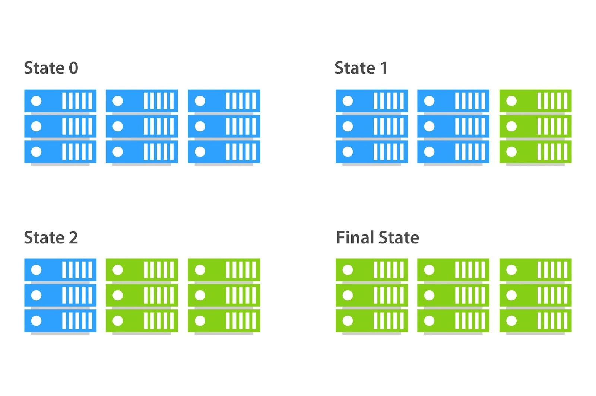

# IAC

Infrastructure as code (IaC) is the ability to provision and configure computing infrastructure using code instead of manual processes and settings.
<br>
Manual infrastructure management is time-consuming and prone to error — especially at scale.
<br><br>Infrastructure as code lets you define your infrastructure's desired state without including all the steps to get to that state.
<br>It automates infrastructure management so developers can focus on building and improving applications instead of managing environments. <br>Organizations use infrastructure as code to control costs, reduce risks, and respond with speed to new business opportunities.

## Configuration management
Configuration management is the process of maintaining and updating the configuration of an IT infrastructure, including hardware, software, and network components.
<br>It involves identifying the current state of the infrastructure, defining the desired state, and implementing changes to move from the current state to the desired state.
<br>Configuration management helps ensure that the infrastructure is consistent, reliable, and secure.

### Example Tools

- Ansible
- Puppet
- Chef

## Orchistration
Orchestration is the process of automating and coordinating complex workflows and tasks within an IT infrastructure.
<br>It involves managing the interactions and dependencies between different systems, services, and applications to ensure that they work together seamlessly to achieve a specific goal. 
<br><br>Orchestration can involve a variety of tasks, such as provisioning and configuring resources, deploying applications, and monitoring performance.
<br>It is often used to manage the deployment of virtual machines(VM) and containers across multiple servers or data centers.

### Example Tools

- Terraform
- AWS CloudFormation
- Azure Resource Manager (ARM)
- Kubernetes

## Configuration Management Vs Orchestration

Configuration management refers to the process of configuring and managing the software and infrastructure components.
<br>Orchestration, on the other hand, refers to coordinating and managing an application's deployment across multiple systems. 

<br>Configuration management includes tasks such as installing software updates and managing system configurations.
<br>Orchestration, on the other hand, includes tasks such as deploying software and managing scaling and failover.

## An example workflow with Terraform and Ansible for a NodeJS app

1. Set up Local Environment:
    - Set up your Node.js app locally
    - Make sure it works on your machine
    - Understand what dependencies it needs

2. Use Terraform to Create Basic Infrastructure:
    - Write a Terraform file that creates an EC2 instance
    - It also creates a security group allowing HTTP and HTTPS inbound
    - ```
        terraform init    # Set up Terraform
        terraform plan    # Preview what will be created
        terraform apply   # Create the infrastructure
        ```

3. Use Ansible to Configure the Server and Deploy Your App:
    - Create a simple inventory file listing your server
    - Create a basic playbook that:
      - Installs Node.js and npm
      - Copies your application files
      - Installs dependencies (npm install)
      - Sets up a process manager (like PM2)
      - Starts your application

## When to use Infrastructure as Code
- You're deploying repeatedly
  - Multiple environments (dev, test, staging, production)
  - Frequent rebuilds or scaling operations
  - Multiple similar projects
  
- You need consistency and reliability
  - Eliminating human error in complex setups
- You have multiple team members
    - Preventing "it works on my environment" problems
  - Your infrastructure is complex

## When to not use Infrastructure as Code
- One-time deployments
  - Simple proof-of-concept projects
  - Short-lived test environments
  
- Very simple infrastructure
  - Single server setups
- Small team with limited bandwidth
  - Learning curve outweighs immediate benefits
  - No time to develop proper IaC practices
- Static, unchanging environments
    - Legacy systems that rarely change

## Return on Investment

Consider the return on investment (ROI) when using IaC
<br>`Value = (Time saved per operation × Number of operations) - Setup time`

## Benefits of IAC

- Consistency / Environment Duplication
- Reduced Room for Error
- Speed and efficiency
- Benefits of version control due to code

## Ansible

### What is Ansible?

Ansible is an open-source IT automation tool, written in Python, used for configuration management, application deployment, orchestration, and task automation.
<br>It allows you to manage infrastructure as code (IaC), enabling repeatable and consistent system administration.

It operates over SSH, meaning no agents need to be installed on the target machines.
<br>It's especially popular for managing cloud infrastructure like AWS EC2 instances.

### Blue-Green Deployment



Tools like Ansible are great for implementing blue-green deployment
<br>Blue-green deployment is a strategy used to release applications with minimal downtime and risk by running two identical environments, known as "blue" and "green".

1. Blue = Live Environment
<br>This is the version currently serving users.

1. Green = New Version
<br>A copy of the environment where the new version of the application is deployed and tested.

1. Switch Traffic
<br>Once the green environment is fully tested and ready, traffic is redirected from blue to green—either instantly (DNS/load balancer switch) or gradually.

1. Blue becomes standby
<br>The previous blue version remains available as a backup in case rollback is needed.

The use of groups like `[web]` can facilitate this

#### Benefits:
- Zero downtime deployments
- Quick rollback: Just switch back to blue if something goes wrong.
- Safe testing in production-like environment

### Installing Ansible - Setting up a Controller Server

1. **Ensure Python is installed**  
   Ansible requires Python 3 to run:
   ```bash
   python3 --version
   ```

2. **Add Ansible's official PPA repository**  
   ```bash
   sudo DEBIAN_FRONTEND=noninteractive apt-add-repository ppa:ansible/ansible
   ```

3. **Install Ansible**
   ```bash
   sudo apt update
   sudo apt install ansible -y
   ```

### SSH Key Setup

1. Generate or provide an existing SSH keypair.
2. Place your private key in the `~/.ssh` folder, e.g.:
   ```bash
   ~/.ssh/my-key.pem
   ```
3. Ensure the file has the correct permissions:
   ```bash
   chmod 400 ~/.ssh/my-key.pem
   ```

### Ansible Inventory

The Ansible inventory file—commonly referred to as the hosts file—is a file where you define the managed nodes (remote systems) that Ansible will control.

Create or edit the `hosts` inventory file:
```bash
sudo nano /etc/ansible/hosts
```

Example inventory file (ini):

```ini
[web]  # Group name

ec2-instance ansible_host=<placeholder-ip> ansible_user=ubuntu ansible_ssh_private_key_file=/home/ubuntu/.ssh/<placeholder-key-name>
```


### Inventory Commands

- List available inventory:
  ```bash
  ansible-inventory --list
  ```
- Display inventory graph:
  ```bash
  ansible-inventory --graph
  ```

### Ad-hoc Commands

Ad-hoc commands are one-liners used to quickly run tasks on remote systems. These are useful for simple, one-time operations.

[Ansible modules](https://docs.ansible.com/ansible/latest/collections/index_module.html)

- **Ping all hosts**
  ```bash
  sudo ansible all -m ping
  ```

- **Run a shell command**
  ```bash
  sudo ansible web -a "uname -a"
  ```
  > Note: If no module is specified, Ansible uses the default `command` module.

- **Update APT cache**
  ```bash
  sudo ansible web -m ansible.builtin.apt -a "update_cache=yes" --become
  ```

- **Upgrade packages**
  ```bash
  sudo ansible web -m ansible.builtin.apt -a "upgrade=dist" --become
  ```

- **Copy a file over**
  ```bash
  sudo ansible web -m ansible.builtin.copy -a "src=<path to file> dest=<destination path>"
  ```

`--become` provides sudo access 

To disable the [WARNING] relating to the discovered Python interpreter
add the following lines to ansible.cfg in /etc/ansible/ansible.cfg

```ini
[defaults]
 
interpreter_python = auto_silent
```

To disable the "known hosts" prompt when using SSH add this line under defaults:
<br>`host_key_checking = False`


### Playbooks

[Playbooks](https://docs.ansible.com/ansible/latest/getting_started/get_started_playbook.html)

Playbooks are YAML files that define a series of tasks to be executed on specified hosts.
<br>Unlike ad-hoc commands, playbooks are reusable, structured, and allow for more complex logic such as conditionals, loops, handlers, etc.

**Playbook**

    A list of plays that define the order in which Ansible performs operations, from top to bottom, to achieve an overall goal.
**Play**

    An ordered list of tasks that maps to managed nodes in an inventory.
**Task**

    A reference to a single module that defines the operations that Ansible performs.
**Module**

    A unit of code or binary that Ansible runs on managed nodes.

Run a playbook:
<br>`ansible-playbook <path to playbook>`

Check syntax of a playbook before running:
<br>`ansible-playbook --syntax-check install-nginx.yml`

Dry run of playbook:
<br>`sudo ansible-playbook --check install_nginx_playbook.yml`