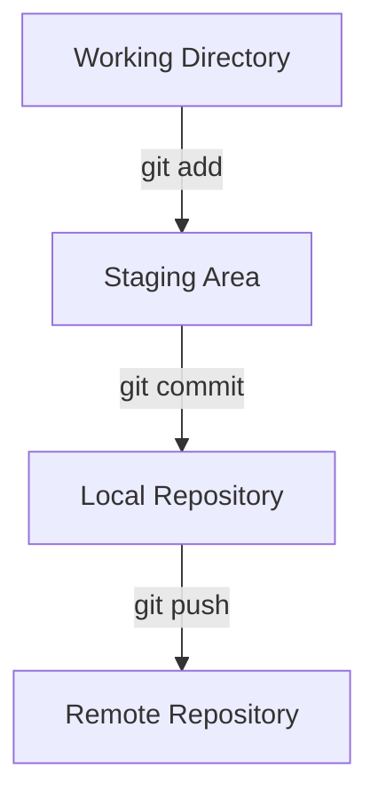

# Git & GitHub Cheat Sheet

## Table of Contents
- [Git \& GitHub Cheat Sheet](#git--github-cheat-sheet)
  - [Table of Contents](#table-of-contents)
  - [Git Basics](#git-basics)
    - [Key Areas](#key-areas)
  - [Git Configuration](#git-configuration)
    - [Config Scopes](#config-scopes)
  - [Working with Commits](#working-with-commits)
  - [Branching \& Merging](#branching--merging)
    - [Why Use Branches?](#why-use-branches)
    - [Common Branch Commands](#common-branch-commands)
    - [Example Workflow](#example-workflow)
  - [GitHub](#github)
    - [Common GitHub Tasks](#common-github-tasks)
  - [Useful Bash Commands](#useful-bash-commands)
  - [Useful Git Commands](#useful-git-commands)
  - [Git Workflow Diagram](#git-workflow-diagram)


## Git Basics
Git is a version control system used to track changes in files and coordinate work.

### Key Areas
- **Working Directory**: Your local project files.
- **Staging Area (Index)**: Where changes are prepared before committing.
- **Local Repository**: Your committed changes.
- **Remote Repository**: A shared repository hosted on a platform like GitHub.


## Git Configuration
```sh
git config --global user.name "Your Name"   # Set username
git config --global user.email "you@example.com"   # Set email
git config --list   # View configuration
```
### Config Scopes
- **System** (`--system`): Applies to all users on the machine.
- **Global** (`--global`): Applies to all repositories for the current user.
- **Local** (`--local`, default): Applies only to a specific repository.


## Working with Commits
```sh
git status   # Check status of working directory
git add .   # Stage all changes
git commit -m "Commit message"   # Commit staged changes
git log   # View commit history
git diff   # Show differences between working directory and last commit
```

## Branching & Merging
### Why Use Branches?
- Develop features without affecting stable code.
- Fix bugs in isolation.
- Collaborate without conflicts.

### Common Branch Commands
```sh
git branch new-feature   # Create a new branch
git checkout new-feature   # Switch to a branch
git merge new-feature   # Merge branch into the current branch
git branch -d new-feature   # Delete a branch
git config --global init.defaultbranch main   # Change default branch name
```

### Example Workflow
```sh
git branch feature-xyz   # Create a new branch
git checkout feature-xyz   # Switch to the new branch
# Make changes and commit them
git checkout main   # Switch back to main branch
git merge feature-xyz   # Merge feature into main
git branch -d feature-xyz   # Delete the feature branch
```


## GitHub
GitHub is a cloud-based Git repository hosting service that allows for collaboration, version control, and project management.

### Common GitHub Tasks
```sh
git remote add origin <repo_url>   # Link local repo to GitHub
git push -u origin main   # Push local repo to GitHub
git pull origin main   # Fetch latest changes from GitHub
git clone <repo_url>   # Clone an existing GitHub repo
```
- Use **Pull Requests (PRs)** to propose and review changes before merging.
- Use **GitHub Issues** to track bugs and tasks.
- Use **GitHub Actions** to automate workflows.


## Useful Bash Commands
| Command | Description |
|---------|-------------|
| `pwd` | Print working directory |
| `ls` | List files and directories |
| `cd <dir>` | Change directory |
| `mkdir <dir>` | Create a new directory |
| `rm <file>` | Remove a file |
| `rm -r <dir>` | Remove a directory recursively |
| `cp <source> <destination>` | Copy a file or directory |
| `mv <source> <destination>` | Move or rename a file or directory |
| `cat <file>` | View the contents of a file |
| `echo "text" > file.txt` | Write text to a file |
| `touch <file>` | Create an empty file |
| `grep "pattern" <file>` | Search for a pattern in a file |


## Useful Git Commands
```sh
git rm --cached <file>   # Unstage a file
git commit -a -m "Message"   # Stage & commit all changes in one step
git reset --hard HEAD~1   # Undo last commit (DANGER: Permanent loss!)
```

## Git Workflow Diagram

